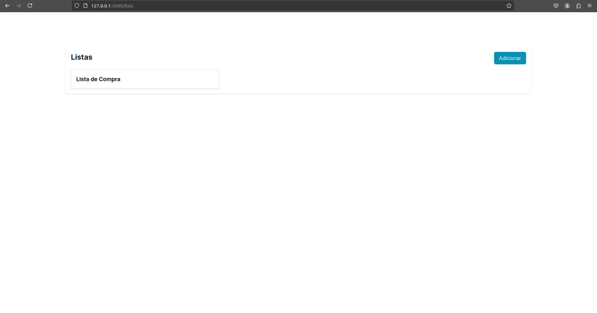
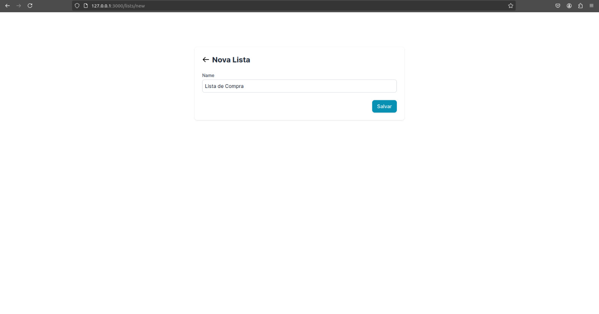
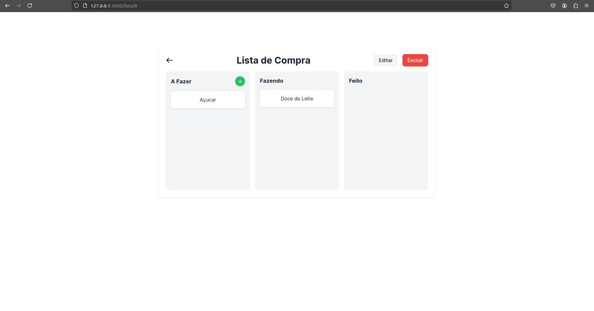
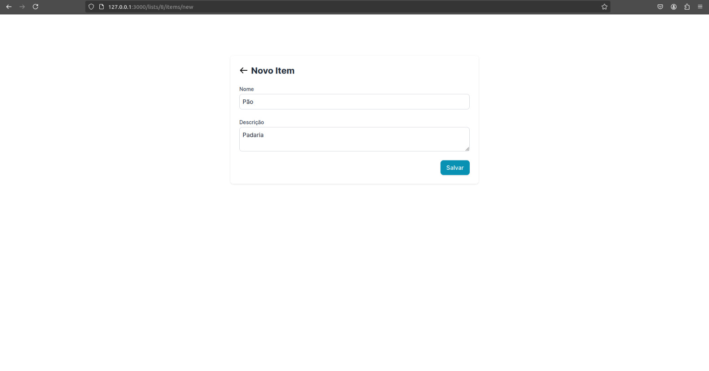

# TO DO List

Este projeto é um simples e eficiente aplicativo de TO DO List desenvolvido com Ruby on Rails. A proposta é gerenciar várias listas, onde cada lista pode conter vários itens organizados em três colunas: **A Fazer**, **Fazendo** e **Feito**.

---

## Instalação e Configuração

### Passo 1: Clonar o repositório

Primeiro, clone este repositório para sua máquina local:

```bash
git clone https://github.com/Eder-Queiroz/to-do-list.git
cd to-do-list
```

### Passo 2: Instalar Ruby on Rails

Certifique-se de ter o **Ruby on Rails** instalado. Caso ainda não tenha, siga o guia de instalação oficial: [Guia de Instalação Ruby on Rails](https://guides.rubyonrails.org/install_ruby_on_rails.html).

### Passo 3: Instalar dependências

No diretório do projeto, execute o seguinte comando para instalar as dependências:

```bash
bundle install
```

### Passo 4: Configurar o banco de dados

Crie e migre o banco de dados:

```bash
rails db:create db:migrate
```

### Passo 5: Iniciar o servidor

Inicie o servidor local:

```bash
rails server
```

Abra seu navegador e acesse `http://127.0.0.1:3000` para ver o aplicativo em execução.

---

## Funcionalidades

### Gerenciamento de Listas

- **Tela inicial**: A primeira tela mostra todas as listas criadas. O usuário pode clicar em **Adicionar** para criar uma nova lista. Veja a imagem abaixo:
  

- **Criação de listas**: Ao clicar em **Adicionar**, o usuário é levado para uma tela onde pode inserir o nome da lista e salvá-la. Exemplo na imagem abaixo:
  

### Gerenciamento de Tarefas

- **Detalhes da lista**: Ao clicar em uma lista, o usuário acessa a tela de tarefas, onde pode:

  - **Editar ou excluir** a lista.
  - **Criar itens** para a lista clicando em **Adicionar**.

- **Arrastar itens entre colunas**: Os itens criados podem ser movimentados entre as três colunas:
  - **A Fazer**
  - **Fazendo**
  - **Feito**



### Criação de Itens

Ao clicar para adicionar um novo item, o usuário é redirecionado para uma tela onde insere o nome e a descrição do item. Após salvar, o item é adicionado à lista. Veja um exemplo abaixo:


---

**Divirta-se organizando suas tarefas com este TO DO List!**
